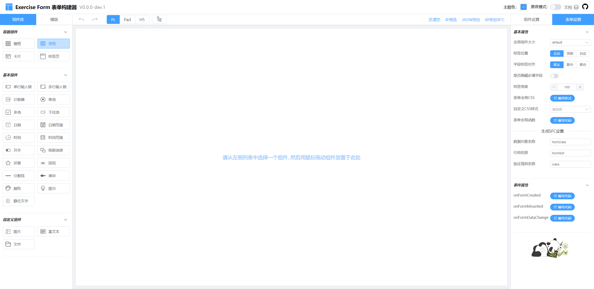

## Exercise Form for Vue3.x and Element-plus

### 立即体验



[项目演示](https://pxhnice.github.io/exercise-form.github.io/)

### 安装依赖

```
pnpm install
```

### 开发调试

```
pnpm dev
```

### 生成打包

```
pnpm build
```

### 使用

#### 1.安装

```
 npm install exercise-form
```

#### 2.引入并全局注册

```ts
//main.ts
import { createApp } from "vue";
import ElementPlus from "element-plus";
import ExerciseForm from "exercise-form"; // 组件引入
import "element-plus/dist/index.css";
import "exercise-form/dist/index.css"; // 样式引入
import * as ElementPlusIconsVue from "@element-plus/icons-vue";
import App from "./App.vue";

const app = createApp(App);

for (const [key, component] of Object.entries(ElementPlusIconsVue)) {
  app.component(key, component);
}

app.use(ElementPlus);
app.use(ExerciseForm);
app.mount("#app");
```

#### 3.在模板中使用构建器组件

```vue
<template>
  <ex-form-designer :form-data="formData" :form-json="formJson" />
</template>
<script lang="ts" setup>
import { ref, reactive } from "vue";
import type { DesFormJson } from "exercise-form";

const formData = ref({}); //表单数据
const formJson = reactive<DesFormJson>({
  formConfig: {}, //表单设置
  widgetList: [] //组件列表
});
</script>
```

#### 4.在模板中使用渲染器组件

```vue
<template>
  <ex-form-render
    ref="vFormRenderRef"
    :widget-list="widgetList"
    :form-config="formConfig"
  />
</template>
<script lang="ts" setup>
import { ref } from "vue";
import type { DesWidgetList, DesFormConfig } from "exercise-form";

const vFormRenderRef = ref();
const formConfig = ref<DesFormConfig>({}); //表单数据
const widgetList = ref<DesWidgetList>([]); //组件列表
</script>
```

### 资源链接

- 项目演示：[https://pxhnice.github.io/exercise-form.github.io/](https://pxhnice.github.io/exercise-form.github.io/)
- 项目文档：[https://pxhnice.github.io/exercise-form-docs.github.io/](https://pxhnice.github.io/exercise-form-docs.github.io/)
